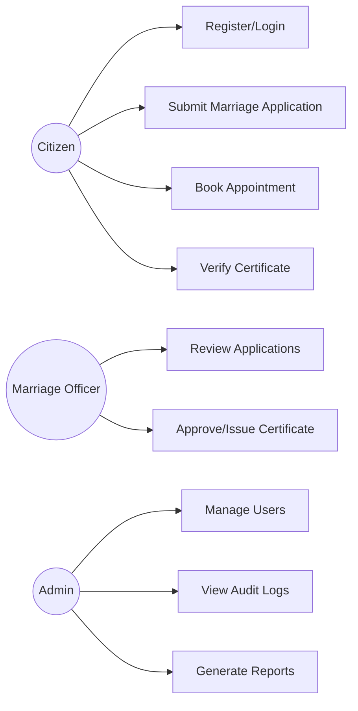
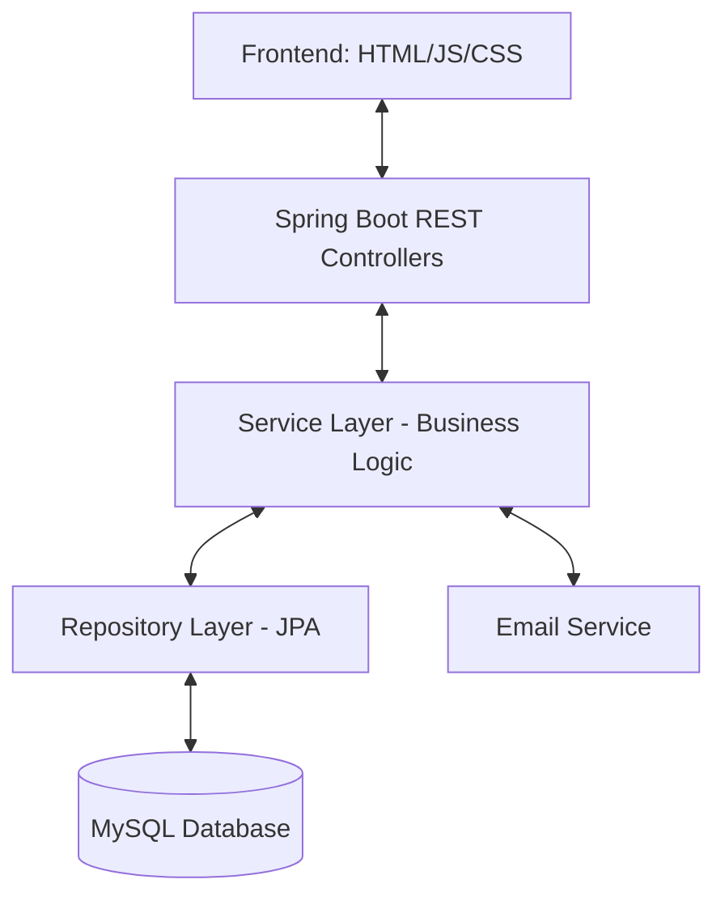
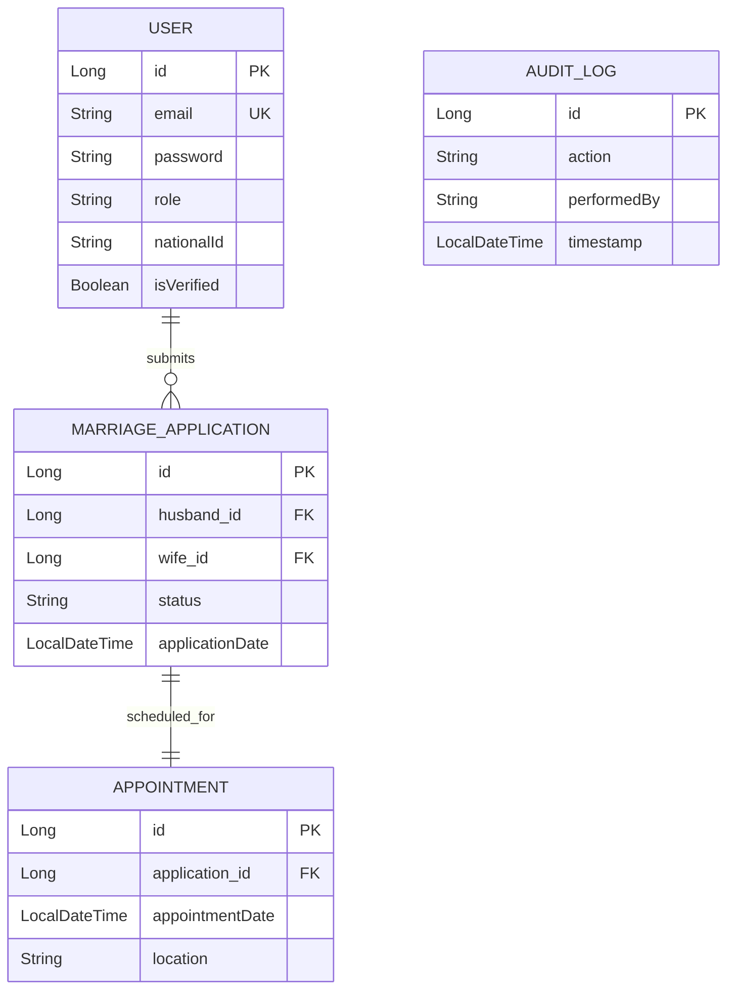

# Digital Marriage System: Design & Planning Report

> [!NOTE]
> This document satisfies the requirements for Phases 1 through 4 (Project Definition, Requirements Analysis, System Architecture, and Database Design).

## 1. Project Definition & Planning (Phase 1)
### Problem Statement
The current manual marriage registration process is time-consuming, prone to human error, and lacks a centralized digital record. Couples often have to visit government offices multiple times to verify documents and receive certificates.

### Project Objective
To develop a secure, transparent, and efficient **Digital Marriage Registration System** that allows citizens to apply online, officers to verify records digitally, and the system to generate verifiable digital certificates.

### Target Users
*   **Citizens**: Can apply for marriage, book appointments, and download certificates.
*   **Marriage Officers**: Can review applications, approve/reject them, and issue certificates.
*   **System Administrators**: Manage users, monitor system logs, and generate reports.

---

## 2. Requirements Analysis (Phase 2)
### Functional Requirements
*   **User Management**: Secure registration, login, and profile management.
*   **Marriage Application**: Online submission of personal details and required documents.
*   **Appointment Scheduling**: Calendar-based booking for marriage ceremonies.
*   **Digital Certificate Generation**: Automated generation of verifiable certificates as PNG/PDF.
*   **Audit Logging**: Tracking all administrative actions for transparency.
*   **Reporting**: Exporting registration data in CSV/Excel formats.

### Use Case Diagram (Conceptual)

---

## 3. System & Architecture Design (Phase 3)
### Technology Stack
*   **Backend**: Java Spring Boot (RESTful API)
*   **Frontend**: HTML5, Vanilla JavaScript, CSS3 (Modern SaaS UI)
*   **Database**: MySQL
*   **Security**: Spring Security (JWT-ready, Session-based)
*   **Communication**: JavaMailSender (Email notifications)

### High-Level Architecture

---

## 4. Database Design (Phase 4)
### Entity Relationship Diagram (ERD)
The system uses a relational schema designed for data integrity and scalability.

---
*Created as part of the Phase 11 Finalization process.*
